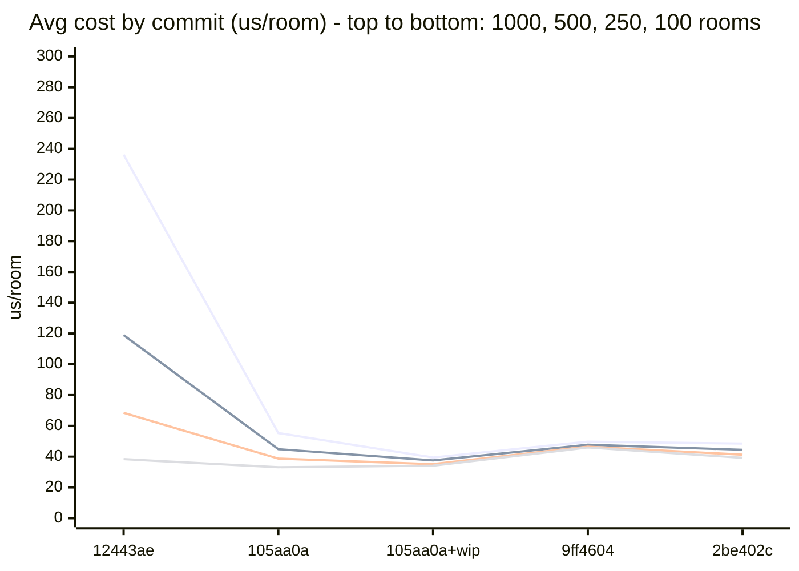

# bevy_ldtk_procgen - Spec & Benchmarks

Human-readable spec of the generation algorithm, plus a running performance log.
Updated by `/prep-commit` right before a commit, so each commit's version of this file
is a snapshot - the point is to be able to compare a future version (e.g. once spatial
hashing replaces the current flat linear collision scan) against today's numbers using
plain git history, not a separate benchmark tool.

## Architecture

Rooms are authored in LDtk (`assets/rooms.ldtk`), one level per room, each carrying
`Door` entities on its edges plus `weight` (float) and `room_type`
(`Spawn`/`Room`/`Hallway`) level fields.

Startup gates through `GenerationState`: `AssetLoading -> Indexing -> Ready`. Once the
LDtk asset is loaded, every level is parsed into a `RoomIndex` (a flat `Vec<RoomDef>`
catalog plus a `HashMap<Dir, Vec<usize>>` index keyed by which direction each room has a
door facing). Generation then runs in `Ready`.

Generation itself is async, not per-frame synchronous placement: `spawn_if_idle` runs
only when idle, clones the current `WorldState` plus a draw from the session RNG, and
spawns a batch on `AsyncComputeTaskPool`. `poll_task` polls it each frame; on completion
it immediately folds every placed room into the real `WorldState` (open-door bookkeeping:
matched doors removed, new doors added) so the next batch's collision checks see accurate
state right away, then queues each room's `LdtkWorldBundle` spawn in a `SpawnQueue`
drained at a capped rate (a few per frame) rather than all at once, so a large batch
doesn't spike frame time when `bevy_ecs_ldtk` populates a level's tiles. `poll_task` only
queues a room for that spawn if it's within `cull_dist` of the camera - rooms placed
further out (within the larger `camera_spawn_dist` readahead radius) stay logical-only
until `cull_and_respawn_rooms` (see Algorithms) brings them in.

Room *entities* are also unloaded and reloaded as the camera moves, independently of the
logical data: `cull_and_respawn_rooms` despawns spawned rooms beyond `cull_dist` (queued
through a `DespawnQueue`, drained the same throttled way as spawning) and respawns known
rooms that come back within a smaller `respawn_dist` (hysteresis, avoids flicker at the
boundary). This never touches `WorldState.rooms`/`room_grid` - only the visual entity -
so collision math is unaffected by what's currently rendered.

## Algorithms

### Room indexing - `build_room_index` (`pipeline.rs`)

Pure function: parses raw LDtk levels into `RoomDef`s (size, door positions/directions/
widths, weight, room type), then builds the `by_door_dir` index. Doesn't touch Bevy
`App`/`AssetServer`, so it's directly callable from tests against the real
`assets/rooms.ldtk`.

### Batch generation - `generate_batch` (`pipeline.rs`)

Given the current `WorldState`, a `RoomIndex`, a camera position, a search radius, a
session-wide room cap, and an RNG:

1. If no rooms exist yet, pick a random `Spawn`-type room and place it at the origin.
2. Otherwise, repeat in passes: find open doors within `search_dist` of the camera, sort
   by distance, and for each one build a weighted candidate list of rooms with a door
   facing the opposite direction, shuffle it, and try each candidate in turn via
   `try_place_room` until one succeeds. Each pass re-scans `open_doors`, so rooms newly
   opened by one pass get picked up by the next - letting a single branch chain multiple
   rooms deep within one async batch instead of growing by only one ring of doors per
   frame. Passes stop once `MAX_ROOMS_PER_FRAME` rooms have been placed this batch, the
   session-wide room cap is hit, or a pass places zero new rooms (no further progress
   possible right now).

The search radius and room cap are now configurable via `WorldPlugin` (`camera_spawn_dist`/
`max_rooms`, threaded through a `GenerationConfig` resource) rather than fixed consts -
pure plumbing, not a behavior change (the defaults are unchanged).

Placements within a batch mutate a local `WorldState` copy immediately, so later doors in
the same batch (including later passes) see earlier placements.

### Spatial indexing - `SpatialHash` (`spatial_hash.rs`)

A uniform grid: `cells: HashMap<(i32,i32), Vec<usize>>` keyed by cell coordinate,
storing indices into `WorldState.rooms`. `insert`/`query` both floor-divide a rect's
four bounds by `cell_size` and enumerate every cell the rect overlaps (multi-cell for
rects larger than one cell); `query` dedupes via a `HashSet` before returning. Scoped to
`rooms` only (append-only, so indices stay valid) - `open_doors` (which uses
`swap_remove`, invalidating indices) stays a linear scan. `WorldState::add_room` is the
one place that pushes to `rooms`, inserts into the grid, and does open-door bookkeeping
together, so the grid can't drift out of sync with the Vec.

### Placement validation - `try_place_room` (`pipeline.rs`)

Returns `Option<Vec<Room>>` (a placement plus any bridging rooms it required). Checks, in
order:

1. New room's rect vs. `room_grid.query(...)` candidates near the new room's footprint -
   the one unconditional, real visual-safety guarantee (no two rooms' tiles are ever
   drawn overlapping).
2. New room's door clearance boxes vs. `room_grid.query(...)` candidates per door
   (queried separately from step 1, since a door's clearance box can extend past the
   room's own footprint) - allowed only if it lands exactly on an existing door spot, or
   if the door is actively completing a connection to an already-open door.
3. Existing open doors' clearance boxes vs. the new room's whole footprint (linear scan
   over `open_doors`) - closes the "doors overlap unrelated rooms" class of bug; allowed
   only if it's the new room's own matching door.
4. New room's doors vs. other open doors' clearance boxes (linear scan) - a collision
   here triggers `find_bridging_room`, tried recursively (bounded by `MAX_BRIDGE_DEPTH`)
   across every candidate that could simultaneously fill both doors, not just the first
   one found.

### Bridging - `find_bridging_room` (`types.rs`)

Given two colliding open doors, returns every room in the catalog whose placement would
satisfy both simultaneously (not just the first match), so `try_place_room` can fall back
to the next candidate if the first fails its own validation.

### Culling - `cull_and_respawn_rooms` (`culling.rs`)

Runs on a `Timer` (every 500ms, not every frame - camera movement between frames is too
small to matter) rather than being state-driven like generation. The actual decisions
are two pure functions on plain `(usize, Vec2)` data (same testable shape as
`generate_batch`/`try_place_room`):

- `rooms_to_cull`: spawned rooms farther than `cull_dist` from the camera.
- `rooms_to_respawn`: known rooms (from `WorldState.rooms`, not regenerated) within a
  smaller `respawn_dist` (`cull_dist * 0.8` - hysteresis) that aren't already spawned
  *or* already queued to spawn. That second condition matters: a room can sit in
  `SpawnQueue` for a while under load (`generate_batch` can place up to
  `MAX_ROOMS_PER_FRAME` rooms in one batch, but only `SPAWNS_PER_FRAME` get drained into
  entities per frame), and the respawn check has to see queued-but-not-yet-spawned rooms
  as already accounted for, or it queues them a second time and `poll_task` spawns a
  duplicate entity for the same room.

Despawns are queued through a `DespawnQueue` and drained at a capped rate in `poll_task`,
the same throttled way spawning already works - despawning everything beyond `cull_dist`
in one frame would reproduce the exact hitch the spawn side was throttled to avoid.

### RNG

One `GenRng` resource (a `SmallRng`) is seeded once per session - from `DUNGEON_SEED` if
set in the environment (reproducible debugging), otherwise from OS entropy. Each batch
draws one `u64` from it to seed a fresh task-local `SmallRng` moved into the async
closure (needed because the task must be `Send + 'static`). This replaced reseeding a
constant every batch, which was the cause of a "repeating patterns" bug (every batch's
"random" shuffle resolved the same way for structurally similar situations).

### Known complexity characteristic

Steps 1-2 of `try_place_room` are now grid-backed (see "Spatial indexing" above), so
per-room cost should scale close to flat with total room count rather than the O(n)
per-room / O(n^2) total cost of the old linear scan. Steps 3-4 (`open_doors`) are still
a linear scan, but that set is small (the dungeon's "frontier"), not the whole placed
history. The benchmark history below now shows the actual before/after: per-room cost
climb from 100->1000 rooms dropped from ~6.2x (pre-spatial-hash) to ~1.67x.

Also observed post-spatial-hash: seed-reachability at higher targets dropped a lot
(e.g. 1000 rooms: 22/50 seeds -> 1/50). This looks unrelated to speed - the leading
suspect is a real behavior change in `try_place_room`'s bridging path: the `pretend`
state used to validate a bridge candidate now goes through `WorldState::add_room`
(which also does open-door bookkeeping) instead of a plain `rooms.push`, so
`pretend.open_doors` is no longer identical to the real `open_doors` during recursive
bridge validation like it used to be. Not yet root-caused with certainty - worth
digging into before trusting the "reaches 1000 rooms" claim at face value.

## Current Performance

As of commit `2be402c` (2026-07-11) - adds room culling/respawn (`cull_and_respawn_rooms`,
`cull_dist` on `WorldPlugin`), runtime-toggleable debug overlays, and a minimal example.
None of this touches `generate_batch`/`try_place_room` or `assets/rooms.ldtk` - culling
only affects which rooms are visually spawned, never the placement algorithm or its
inputs, so this run is a clean comparison against the last one (no asset change to
confound it this time):

- **100 rooms**: avg 39.22 us/room (42/50 seeds reached target)
- **250 rooms**: avg 41.25 us/room (37/50 seeds reached target)
- **500 rooms**: avg 44.47 us/room (24/50 seeds reached target)
- **1000 rooms**: avg 48.50 us/room (11/50 seeds reached target)

Per-room cost climb is ~1.24x (100 -> 1000 rooms), in the same range as recent runs -
expected, since nothing in this commit touches the placement algorithm. Seed-reachability
moved around across targets (500 rooms: 24/50 vs 32/50 last run; 1000 rooms: 11/50 vs
24/50) purely from run-to-run seed noise, same as the swings already seen in earlier rows
of this table (e.g. `12443ae`'s two back-to-back runs) - not attributable to this commit,
which doesn't touch `try_place_room`/bridging either.

## Benchmark History

Each row is one `/prep-commit` run of `generation_speed_by_target`
(`src/world/tests.rs`): for each target room count, up to 50 different seeds are tried
and only the runs that actually *reach* that target are averaged (a run that stalls
early - the known bridging-fallback gap, a correctness issue, not a speed one - is
excluded rather than averaged in, so that unrelated bug can't masquerade as a speed
change). Cells are `avg us/room (seeds reached/50)`; `N/A` means zero seeds reached that
target this run, which is itself meaningful (worth a Notes callout, not silently dropped).

| Date       | Commit        | 100 rooms     | 250 rooms     | 500 rooms      | 1000 rooms     | Notes                                                                                                                                                                                                                                                                                                                                                                                                                                                                                                              |
|------------|---------------|---------------|---------------|----------------|----------------|--------------------------------------------------------------------------------------------------------------------------------------------------------------------------------------------------------------------------------------------------------------------------------------------------------------------------------------------------------------------------------------------------------------------------------------------------------------------------------------------------------------------|
| 2026-07-08 | `12443ae`     | 38.37 (41/50) | 68.46 (39/50) | 118.93 (35/50) | 236.18 (22/50) | Baseline before spatial hashing. Numbers refreshed on a second run of the same pending (uncommitted) working tree - small movement vs. the first measurement is normal seed noise, not a code change.                                                                                                                                                                                                                                                                                                              |
| 2026-07-08 | `105aa0a`     | 33.13 (30/50) | 38.73 (18/50) | 44.87 (7/50)   | 55.31 (1/50)   | First post-spatial-hashing measurement (feature/spatial-hashing rebased onto main). Per-room cost flattened a lot (see Current Performance), but seed-reachability at higher targets dropped sharply - suspected bridging-validation bug (pretend.add_room now runs open-door bookkeeping it didn't before), not a speed regression. Needs follow-up before trusting the 1000-room number.                                                                                                                         |
| 2026-07-10 | `105aa0a`+wip | 34.12 (34/50) | 35.13 (23/50) | 37.54 (15/50)  | 39.46 (6/50)   | Uncommitted working tree on top of 105aa0a - adds multi-pass branch chaining to generate_batch (chains a branch multiple rooms deep per async batch) and a SpawnQueue frame-rate limiter to poll_task; numbers reflect the working tree, not a specific commit. Per-room cost climb flattened further (~1.16x vs ~1.67x), and 1000-room seed-reachability partially recovered (6/50 vs 1/50) but is still well short of the pre-spatial-hash 22/50 - the suspected bridging-validation regression remains unfixed. |
| 2026-07-10 | `9ff4604`     | 45.96 (41/50) | 46.51 (37/50) | 47.73 (32/50)  | 49.74 (24/50)  | lib/examples restructure plus GenerationConfig (camera_spawn_dist/max_rooms configurable, no algorithm change) bundled with a substantial assets/rooms.ldtk content change (~10% more entities). Seed-reachability jumped a lot at every target; since none of this commit's code changes touch try_place_room/bridging, the larger room catalog is the leading suspect, not the code - not yet isolated from the asset change to confirm.                                                                         |
| 2026-07-11 | `2be402c`     | 39.22 (42/50) | 41.25 (37/50) | 44.47 (24/50)  | 48.50 (11/50)  | Adds room culling/respawn, runtime debug toggles, and a minimal example - none of it touches generate_batch/try_place_room or assets/rooms.ldtk, so this is a clean comparison against the last row. Reachability swings are normal seed noise (see the two back-to-back 12443ae runs earlier in this table for the same effect), not a regression.                                                                                                                                                                |

### Performance Chart

One combined chart, x-axis = commit history, one line per target - regenerated (one more
x-axis entry, one more point per line) every `/prep-commit` run. Mermaid's `xychart-beta`
has no per-line legend, so this relies on the four targets' natural ordering instead: the
1000-room line sits on top, 100-room on the bottom, in that order, in every run so far.
Watch this once spatial hashing lands: today each line should be roughly flat run-to-run
(same version, same cost), and the *gap* between the top and bottom lines is the number
that should shrink - the four lines converging toward each other is exactly what "cost no
longer depends much on room count" looks like.

